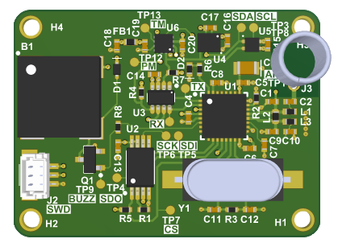
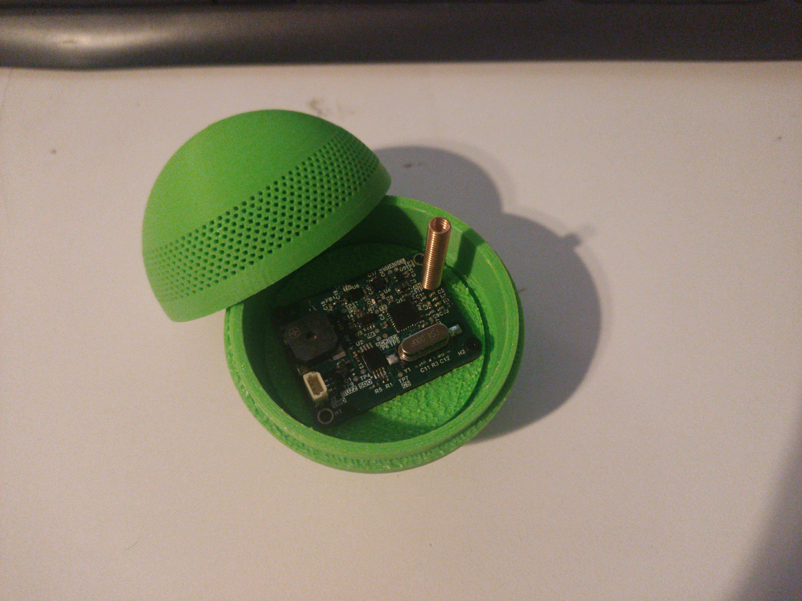

# Environmental Sensor

This is a miniature environmental sensor node designed for a hydroponic system. Each node is powered by a CR2032 battery and communicates with others over 433 MHz RF.

# Features

* MSPM0 32-bit MCU
* nRF9E5 transceiver
* 2× Temperature sensors
* Humidity sensor
* Pressure sensor
* 6-degree IMU
* Up to 9 months battery life
* 433 MHz RF communication
* Error indication via buzzer and LED

# Enclosure 

